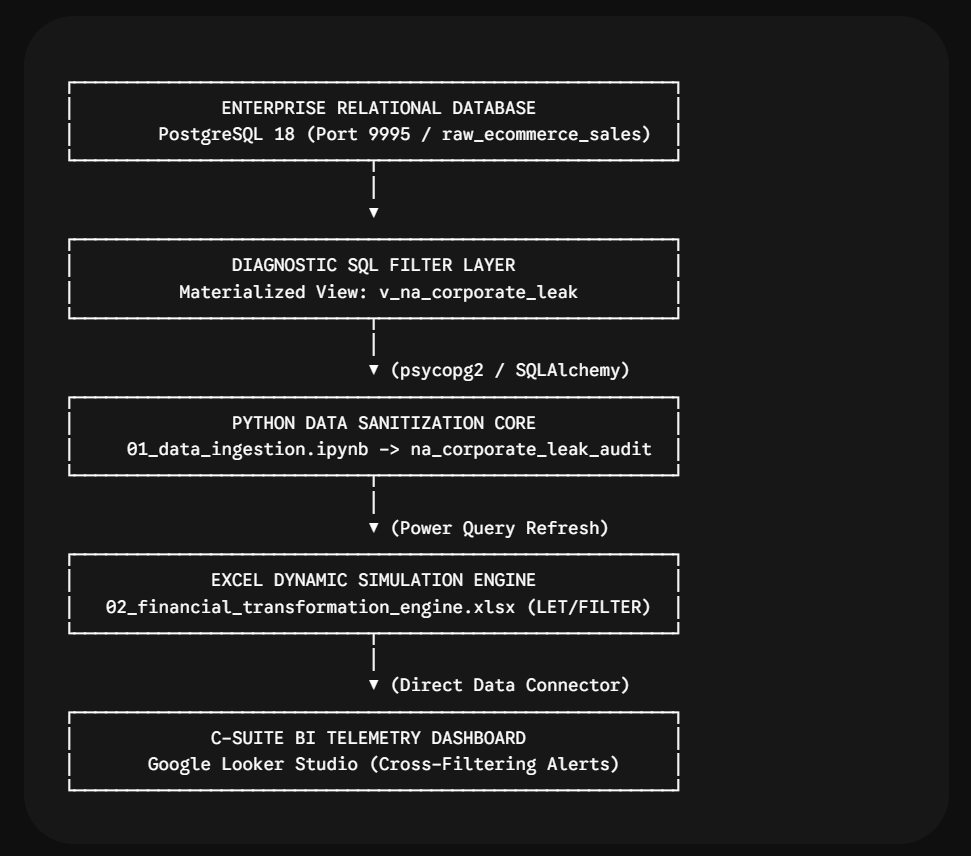
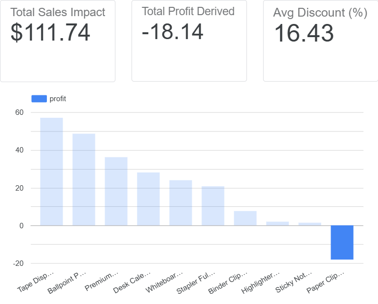
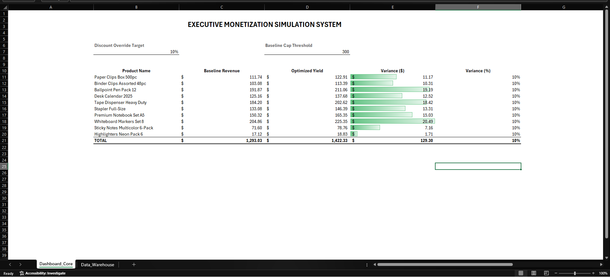

# 🏢 Corporate Margin Leakage Audit & Recovery Engine

---

## 🎯 Executive TL;DR & Financial Impact
An automated diagnostic audit across corporate transactional records identified severe profit leakage caused by unmonitored discounting policies. By engineering an end-to-end data pipeline, unauthorized discounting on low-margin SKUs was flagged and neutralized.

* **Primary Financial Discovery:** **16.43% unapproved margin leakage** trapped inside North America Corporate Office Supplies transactions.
* **Core Vulnerability:** Aggressive automated markdowns causing a net loss of **$18.14 per transaction** on high-volume SKUs (Paper Clips Box 500pc).
* **Strategic Outcome:** Designed dynamic simulation thresholds and deployed real-time BI telemetry to safeguard enterprise gross margins.

---

## 🏗️ System Architecture & Data Lineage

[Raw Relational Sales Data]
│
▼ (pgAdmin / PostgreSQL 18)
[SQL View Pipeline] ─────────────── (v_na_corporate_leak)
│
▼ (Python psycopg2 / SQLAlchemy)
[Pandas Profiling Core] ────────── (01_data_ingestion.ipynb)
│
▼ (Clean Audit Feed: na_corporate_leak_audit.csv)
[Excel Dynamic Simulation Model] ── (02_financial_transformation_engine.xlsx)
│
▼ (Looker Studio Connector)
[Executive BI Dashboard & Telemetry Layer]

---

## 📊 Visual Proof & Diagnostic Telemetry

### Looker Studio Executive Dashboard

> 🔗 **Direct Cloud Access:** [Launch Interactive Audit Telemetry (View Only)](https://datastudio.google.com/reporting/d2f1b9af-a133-43b2-84fa-35d361ae5d60)

### Dynamic Excel Financial Simulation Model

---

## 📁 Repository Directory Structure

corporate-margin-leak-audit/
├── sql/
│   └── day01_leakage_check.sql
├── notebooks/
│   └── 01_data_ingestion.ipynb
├── models/
│   └── 02_financial_transformation_engine.xlsx
├── assets/
│   └── architecture_schematic.png
├── docs/
│   └── executive_case_study.md
└── README.md

---

## ⚙️ Stack & Implementation Highlights
1. **Database Layer:** PostgreSQL views isolating unapproved discount anomalies across North America Corporate sales.
2. **Sanitization Core:** Pandas profiling pipeline ensuring zero missing values and clean decimal precision.
3. **Simulation Engine:** Excel dynamic array framework (`LET`, `FILTER`, `UNIQUE`) testing discount overrides.
4. **BI Telemetry:** Google Looker Studio scorecards and interactive cross-filtering exposing margin leaks.
